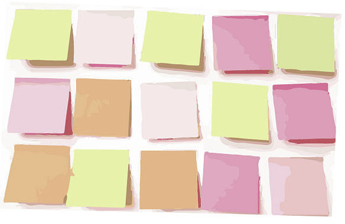

### Share your warm-up answers

## Who does accessibility help?
## Who will you share the stuff from the workshop with?

---

## Know someone with this barrier?
# Add a tick **✔︎**

---

# Equations chat

^ Justin and Steve talk through
5m

---

# Personas tour
##  Pick a few to focus on

^ Pick a few to focus on
15m

---

# Make a checklist
## Using Appendix A

^ A Web For Everyone
20m

---

# How To?
## (tool, process, pattern?)
## ctfeds.org/gaadr

^ tool, process, code, pattern
10m

---

# Work on your stuff

---

## Inclusive Design At Your Office
# SMART Goal

^ Value, Affect?
blog post, tweets, share on meetup, Slack groups.

---

### Facilitator Feedback
## One Thing We Could Do Differently

^ Anonymous is fine
5m
