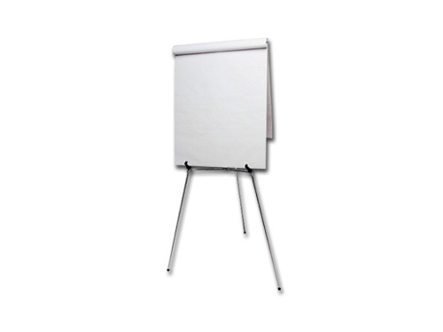

### Share your warm-up answers

### Who does accessibility, Universal Design, and Human-Centered Design help?
### Who will you share the stuff from the workshop with?

---

## Know someone with this barrier?
# Add a tick **✔︎**

---

# Equations chat

^ Justin -> inclusive design
Steve -> Disability
5m

---

# Personas tour
##  Pick one or two to focus on

^ Familiar with personas?
Pick one or two to focus on
15m

---

# Make a checklist
## Using Appendix A

^ A Web For Everyone
20m

---

# How To?
## (tool, process, pattern?)
## ctfeds.org/odctr

^ tool, process, code, pattern
10m

---

# Break! :)

---

# Work on your stuff

---

## Inclusive Design Where You Work
# SMART Goal

^ Value, Affect?
blog post, tweets, share on meetup, Slack groups.

---

### Facilitator Feedback
## One Thing We Could Do Differently

^ Anonymous is fine
5m
