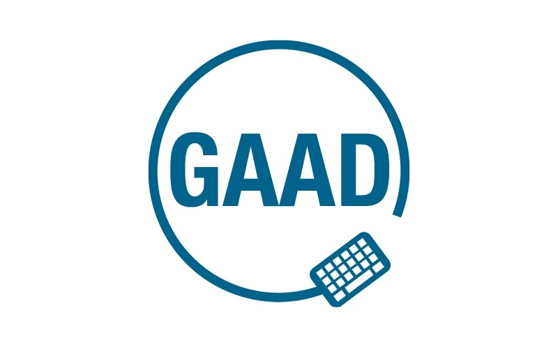
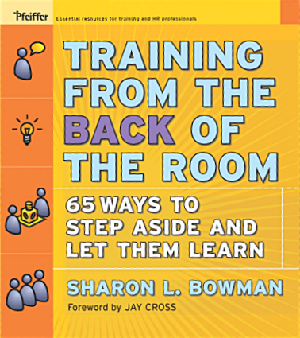
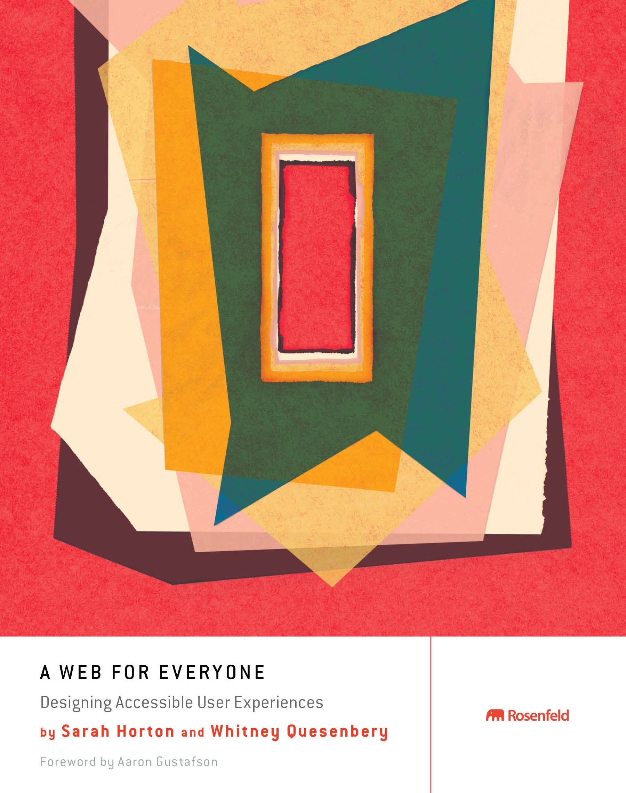

# Global Accessibility Awareness Day

^  Thursday, May 19 2016
36 events
US, Canada, UK, India, Australia, Japan, Switzerland, Argentina, France

---

  

---

# 5W1H
# (of Accessibility)

^ 5 Ws and 1 H
information-gathering or problem-solving

---

# Who
# What
# When
# Where
# Why
# How

---

# WHO
# does it affect?

^ Not just "disabled" users
Everyone.

---

# WHAT
# does it mean?

^ Situational
Contextual
Temporary
Age

---

# WHEN
# should we
# consider it?

^ At the start for inclusive design
Throughout as regular checks

---

# WHERE
# in our sites
# and apps?

^ Everywhere
Especially markup, navigation, layout

---

# WHY
# should we care?

^ People!
Human-Centered Design
Diverse audience

---

# HOW
# can we help?

^ That's what we'll find out today :)
