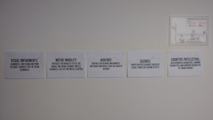

All based heavily on the amazing book [A Web for Everyone](http://rosenfeldmedia.com/books/a-web-for-everyone/) (Designing Accessible User Experiences) by Sarah Horton & Whitney Quesenbery. Training methods based on techniques in [Training From The Back Of The Room](http://bowperson.com/training-from-the-back-of-the-room/) by Sharon Bowman.

## Documents

* [Workshop Outline](workshop-outline/)
* [Instructions](decks/instructions.pdf) (PDF)
* [Resources](resources/) (also as [ctfeds.org/odctr](http://ctfeds.org/odctr))

### Personas

* [A Web for Everyone Resources](http://rosenfeldmedia.com/books/a-web-for-everyone/#resources) (scroll down to **Meet the personas**)
* [Accessible UX Personas Overview](personas/AccessibleUX-Personas-Overview1.pdf) (PDF)

## Poster for the walls

* [Equations](print-for-wall/equations.pdf) (PDF)

## Handouts

* [Universal Design Principles](print-for-wall/universal-design-principles.pdf) (PDF)
* [WCAG POUR Framework](print-for-wall/wcag-pour-framework.pdf) (PDF)
* [Accessible User Experience Framework](print-for-wall/accessible-user-experience-framework.pdf) (PDF)

## Photos

### Stuff on walls

Barriers with ticks  .

## Facilitator Feedback

* It was nice. I really liked the tools on [ctfeds.org/odctr](http://ctfeds.org/odctr). Looking forward to using them in my projects. Also like that the meetup is during the day.
* Great workshop. Many, many, thanks. Suggestions: it would be great if we could do a practical example in future similar workshop where you guys take us, or future attendees, through it.
* Perhaps have a website concept that a group can work on and attempt to solve the problem using the accessbility guidelines.
* Don't really have anything to suggest to do differently, but would like to give "what to keep doing..." 1. Keep interactivity. Forcing to take part, do exercises, etc. It helps with understanding the subject. Thanks!
* Case study / practically apply insight to.
* It was nice learning about personas because I never focus on disabled people when I am solving the problem.
* Perhaps an example of how to add ARIA to one's code.
* Absolutely perfect workshop - mind blown!
* Great start. For a subject so complex definitely needs a follow p with a practical (simple) exercise, and group analysis of a "good" site and a "poor" site.
* Give worked examples. Perhaps talk through some tools / screen readers to give more awareness of the area.
* Worked examples that tie back to the personas.
* All very good - thanks. Intros from people at the start. Break the ice, near expectations, understand each others level of understanding, etc.
* Was happy with what I learnt today. Was my first meetup so didn't expect the interactive nature of the workshop but loved it. Assisted with the learning.
* Group discussions.

## Notes for improvements next time

* A practical example, with before and after, worked through by the faciliators.
* A practical example worked through by the attendees.
* Be clearer about attendees bringing a project to work on during the workshop.
* Facilitators shouldn't forget to intriduce themselves!
* Make the opening activity more introduction-y: "share your answer **with three new people**."
* Pick one persona. Makes it easier to make choices.
* Add [GAAD activities](http://ctfeds.github.io/Global-Accessibility-Awareness-Day-2016/workshop-outline/#do-gaad-activities-20m) back in (powerful experience). Choose according to persona?
* Maybe review resources page, organise a bit more, spend less time looking at them and more time coding?
* What technical level should attendees be at?
