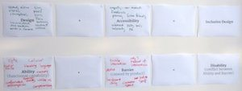
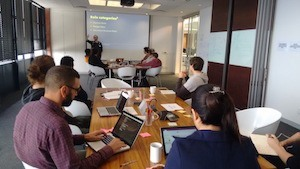
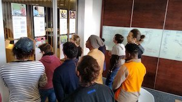
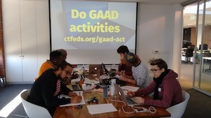
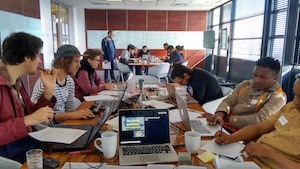

All based heavily on the amazing book [A Web for Everyone](http://rosenfeldmedia.com/books/a-web-for-everyone/) (Designing Accessible User Experiences) by Sarah Horton & Whitney Quesenbery. Training methods based on techniques in [Training From The Back Of The Room](http://bowperson.com/training-from-the-back-of-the-room/) by Sharon Bowman.

## Lightning talks

* Steve: [5Ws and 1H of Accessibility](decks/lightning-talk-steve.pdf)
* Justin: [WAI-ARIA](decks/lightning-talk-justin.pdf)

## Documents

* [Workshop Outline](workshop-outline/)
* [Instructions](decks/instructions.pdf) (PDF)
* [Resources](resources/) (also as [ctfeds.org/gaadr](http://ctfeds.org/gaadr))

### Personas

* [A Web for Everyone Resources](http://rosenfeldmedia.com/books/a-web-for-everyone/#resources) (scroll down to **Meet the personas**)
* [AccessibleUX Personas Overview](personas/AccessibleUX-Personas-Overview1.pdf) (PDF)

## Poster for the walls

* [Equations](print-for-wall/equations.pdf) (PDF)
* [Universal Design Principles](print-for-wall/universal-design-principles.pdf) (PDF)
* [WCAG POUR Framework](print-for-wall/wcag-pour-framework.pdf) (PDF)
* [Accessible User Experience Framework](print-for-wall/accessible-user-experience-framework.pdf) (PDF)

## Photos

### Stuff on walls

Barriers with ticks  .

Equations .

## People on floors

## Facilitator Feedback

* Practical exercises for the newbies, because the audience might have been lacking accessibility.
* Loved the activities. Perhaps we could try a practical coding example next time? Really enjoyed the personas too. Didn't think on some disabilities that could affect usage. Also enjoyed thinking more deeply on the topic. Facilitators also knowledgable which is great.
* Loved: the interaction between members; good vibe, good question stimulation, resulting in good discussions; name tags; sit among us. Can improve: ask each person to talka a little about themselves; combine the two tables (right now I only know the two people sitting next to me)
* Have attendees do practical examples, for example on Codepen.
* Compared to the last CTFEDs meetup this one was more involving which is good. Liked it.
* Not quite sure how the personas fit in? Maybe get us to choose one at the start of the workshop. We then try to roleplay being that person.
* Live example with further investigation and discussion as part of presentation -> Will make it even more awesome! :)
